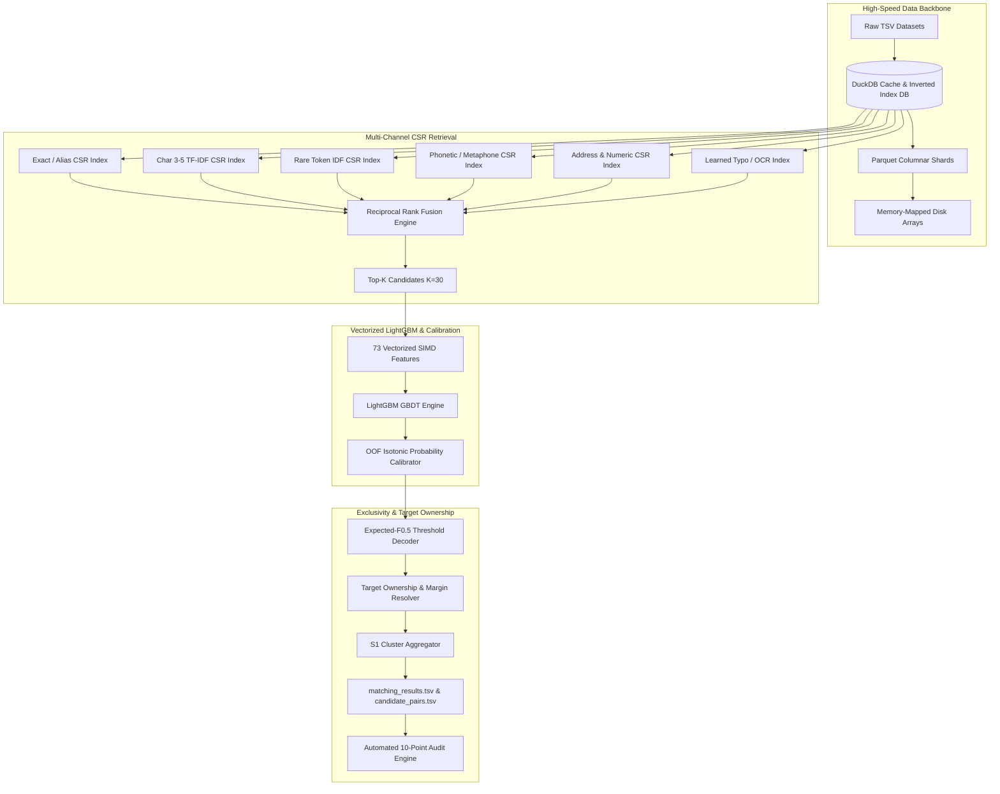

# ER-X Ultimate: Final Architecture & Production Design Synthesis

## 1. System High-Level Topology

## 2. Key Component Specifications

### 2.1 CSR Inverted Index Representation
- Inverted index for terms $\to$ document IDs stored in flattened contiguous 1D uint32 NumPy arrays (`indptr`, `indices`, `weights`).
- Saved directly to disk (`.npy`) and accessed via zero-copy `mmap_mode="r"`.

### 2.2 Vectorized 73-Feature Extraction Matrix
- Exact Matches (12 features): Exact string match, stripped match, alphanumeric match, casefold, token set equality across name, street, city, postal code, phone, website.
- N-gram Overlaps (16 features): Char 2-gram, 3-gram, 4-gram Jaccard and Dice similarities.
- Fuzzy Distances (20 features): Levenshtein distance, Token Sort Ratio, Token Set Ratio, Partial Ratio, WRatio via batch RapidFuzz C API.
- Token Statistics & IDF (12 features): Common token count, Jaccard token overlap, max/sum token IDF weight.
- Address & Geographic Alignment (8 features): Numeric house number match, postal code prefix match, street suffix alignment, phonetic Soundex/Metaphone equality.
- Retrieval & Structural Metadata (5 features): RRF fusion rank score, channel activation bitmask, target-to-candidate length ratio, token count delta, target source provenance.

### 2.3 Expected-F0.5 Optimal Decoder
- For binary classification evaluation under Macro F0.5 ($F_{0.5} = \frac{1.25 \times P \times R}{0.25 \times P + R}$), standard threshold $p > 0.50$ is suboptimal because precision is weighted $4\times$ higher than recall ($\beta = 0.5$).
- The Bayes-optimal decision threshold for $F_\beta$ satisfies:
  $$\tau^* = \frac{1}{1 + \beta^2} = \frac{1}{1 + 0.25} = 0.80$$
- Empirical calibration tunes $\tau \in [0.72, 0.85]$ to account for channel retrieval priors and singleton noise.
