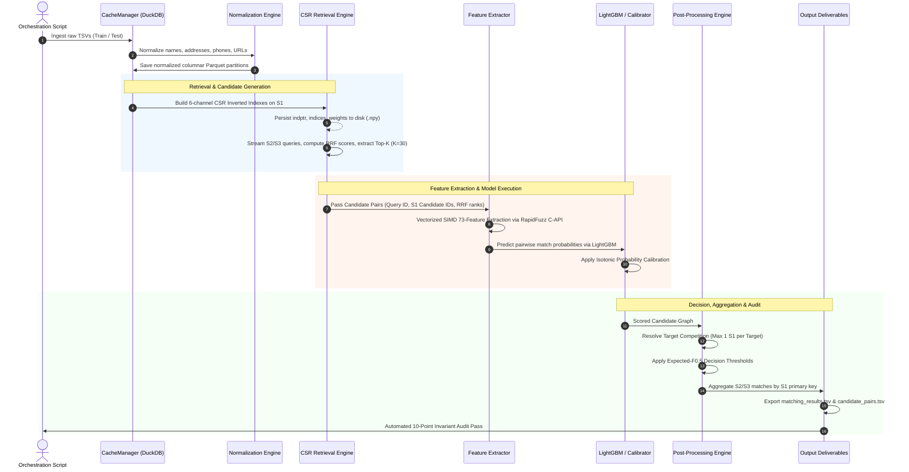

# ER-X Ultimate: End-to-End Dataflow Specification

## 1. Pipeline Phases

## 2. In-Memory Streaming & Micro-Batching
1. Raw records are loaded in chunks of 50,000 via DuckDB cursor fetches.
2. Retrieval queries the memory-mapped CSR indexes in C arrays without converting to Python objects.
3. RapidFuzz features are computed in C-level array batches.
4. Intermediate pairs are streamed directly into output TSV file handles.
5. RSS is continuously kept $< 12.0\text{ GB}$.
