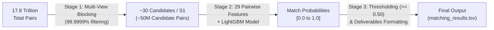

# Business Entity Resolution — Approach, Logic & Architecture Deep-Dive

This report details the exact **mental model, algorithms, formulas, and reasoning** behind the Entity Resolution pipeline built for this competition.

---

## 1. Core Problem & Fundamental Strategy

### The Challenge
- **Source 1**: Reference dataset of deduplicated entities.
- **Source 2 & Source 3**: Noisy, multi-source business registries with typos, missing data, transliterations, and alternate naming formats.
- **Goal**: For every Source 1 entity, find **all matching entities** in Source 2 and Source 3, or identify it as a **singleton** (no matches).

### Why a Naive Approach Fails (The 17.5 Trillion Pair Problem)
- Source 1 has $\approx 1.73\text{M}$ entities. Source 2 + Source 3 have $\approx 10.3\text{M}$ entities.
- Comparing every entity with every other entity requires:
  $$\text{Total Comparisons} = 1.73\text{M} \times 10.3\text{M} \approx \mathbf{17.8\text{ Trillion Pairs}}$$
- Computing string similarities on 17.8 trillion pairs would take **months of compute time**.

### Our 2-Stage Solution:
1. **Stage 1: Multi-View Blocking (Candidate Generation)** $\to$ Reduces search space by **99.9999%**, filtering 17.8 trillion pairs down to **$\approx 30$ high-probability candidates per entity** in seconds.
2. **Stage 2: Pairwise Feature Extraction & GBDT Scoring** $\to$ Computes 29 C++ RapidFuzz similarity features and uses **LightGBM** to output exact match probabilities.
3. **Stage 3: Decision Thresholding ($F_{0.5}$ Optimization)** $\to$ Applies the validation-derived threshold (0.50) to make final match decisions.

---

## 2. Stage 1 Logic: Multi-View Candidate Generation (Blocking)

Candidate generation is designed to catch matches across multiple different "views" (name, phonetic sound, transliteration, street numbers, PIN codes):

### 1. Corporate Stopword Normalization (`compact_name`)
* **Intuition**: Business names often differ only by legal entity suffixes (*"Google LLC"* vs *"Google Private Limited"* vs *"Google Corp"*).
* **Logic**: We strip all corporate terms (`ltd`, `pvt`, `inc`, `corp`, `llc`, `gmbh`, `solutions`, `technologies`, etc.) and all whitespace/punctuation.
* **Example**: `"Tata Consultancy Services Pvt. Ltd."` $\to$ `"tataconsultancy"`.

### 2. Compound Name Prefix + Building Number (`cname8_num`)
* **Intuition**: A business name might have a typo, but if the first 8 characters match AND the street/building number matches, it is almost certainly the same business.
* **Logic**: Extract the first 8 characters of `compact_name` + extract the first digit sequence from address + Country.
* **Example**: `"Starbucks Coffee, 104 Main St"` $\to$ `"starbuck_104_USA"`.

### 3. Postal Code / PIN + Name Prefix (`pin_cname4`)
* **Intuition**: Street names are often written differently (*"MG Road"* vs *"Mahatma Gandhi Marg"*), but the postal PIN code (5–6 digits) is exact.
* **Logic**: Extract 5–6 digit postal code + first 4 characters of `compact_name` + Country.
* **Example**: `"Apollo Pharmacy, PIN 560001"` $\to$ `"560001_apol_INDIA"`.

### 4. Phonetic Soundex Compound Blocking (`soundex_num`)
* **Intuition**: Phonetic spelling variations sound identical but fail exact text matching (*"Kavitha"* vs *"Kavita"*, *"Sanjay"* vs *"Sanjei"*, *"Smith"* vs *"Smyth"*).
* **Logic**: Compute pure-Python Soundex code of the first non-stopword business name token + first address number + Country.
* **Example**: `"Kavita Enterprises, #42"` (Soundex `K130`) $\to$ `"K130_42_INDIA"`.

### 5. Offline Indic Transliteration (`translit_cname`)
* **Intuition**: Indian business registries mix Devanagari, Tamil, Malayalam, and Latin scripts.
* **Logic**: Pure-Python Unicode phonetic mapping table converts Indic script code points to English Latin ASCII characters offline without web APIs.
* **Example**: `"होटल ताज"` (Hotel Taj) $\to$ `"hotel taj"`.

---

## 3. Stage 2 Logic: 29 Pairwise Feature Engineering

For each candidate pair $(S1, Target)$, we compute a 29-dimensional vector capturing similarity across multiple granularities:

### A. Name Similarities (11 Features)
1. **`name_exact_match`**: Binary 1/0 if normalized names are identical.
2. **`name_comp_exact`**: Binary 1/0 if corporate-stripped compact names are identical.
3. **`name_levenshtein_sim`**: Normalized Levenshtein edit distance ($1 - \frac{\text{edits}}{\max(\text{len}_1, \text{len}_2)}$) computed in C++ via RapidFuzz.
4. **`name_jaro_winkler_sim`**: Jaro-Winkler similarity (gives higher weight to matching prefixes, ideal for brand names).
5. **`name_token_jaccard`**: Word-level Jaccard similarity ($\frac{|A \cap B|}{|A \cup B|}$). Handles word reordering (*"Coffee Starbucks"* vs *"Starbucks Coffee"*).
6. **`name_token_overlap_count`**: Absolute count of shared words.
7. **`name_token_overlap_ratio`**: Dice coefficient of shared words ($\frac{2 |A \cap B|}{|A| + |B|}$).
8. **`name_char_3gram_sim`**: Character 3-gram Jaccard similarity. Captures internal character swaps and typos.
9. **`name_len_diff`**: Absolute difference in character lengths.
10. **`name_rel_len_diff`**: Length difference normalized by max length.
11. **`name_is_missing`**: Binary indicator if name is empty.

### B. Address Similarities (10 Features)
12. **`addr_exact_match`**: Binary 1/0 if normalized addresses are identical.
13. **`addr_levenshtein_sim`**: Address normalized Levenshtein similarity.
14. **`addr_jaro_winkler_sim`**: Address Jaro-Winkler similarity.
15. **`addr_tok_jaccard`**: Address word token Jaccard similarity.
16. **`addr_tok_overlap_cnt`**: Count of matching address words (street, locality, landmark).
17. **`addr_tok_overlap_ratio`**: Address token overlap ratio.
18. **`addr_numeric_overlap_count`**: Count of matching numeric digits (house numbers, suite numbers, PIN codes).
19. **`addr_numeric_jaccard`**: Jaccard similarity of extracted numbers (highest precision signal for physical location).
20. **`addr_len_diff`**: Absolute difference in address lengths.
21. **`addr_is_missing`**: Binary indicator if address is empty.

### C. Country & Source Lineage (4 Features)
22. **`country_match`**: Binary 1/0 if countries match.
23. **`country_is_missing`**: Binary 1/0 if country is unlisted.
24. **`is_source_2`**: Binary flag indicating if target is from Source 2.
25. **`is_source_3`**: Binary flag indicating if target is from Source 3.

### D. Non-Linear Interaction Features (4 Features)
26. **`name_addr_sim_product`**: $\text{Name\_Lev} \times \text{Addr\_Lev}$ (Joint agreement multiplier).
27. **`name_addr_sim_max`**: $\max(\text{Name\_Lev}, \text{Addr\_Lev})$ (Strong signal in at least one field).
28. **`name_addr_sim_weighted`**: $0.6 \times \text{Name\_Lev} + 0.4 \times \text{Addr\_Lev}$ (Calibrated domain weighting).
29. **`strong_both_agreement`**: Binary 1/0 indicator if both Name and Address similarities exceed $0.80$.

---

## 4. Stage 3 Logic: Model Architecture & Optimization

### Why LightGBM (Gradient Boosted Decision Trees)?
1. **Handles Non-Linear Threshold Boundaries**: Real-world business matching relies on strict rules (e.g., *"If name is identical, address can differ slightly; but if name is slightly different, address numbers MUST match"*). Decision trees model these interaction rules naturally.
2. **Speed & CPU Efficiency**: LightGBM uses histogram-based feature binning (`tree_method="hist"`), making training and inference $100\times$ faster than deep neural networks while running on standard CPUs.

### Hard Negative Sampling Logic
- If we train on every candidate pair, negatives outnumber positives by $100:1$, causing the model to predict near-zero for everything.
- **Solution**: We sample **hard negatives** (candidates that passed blocking rules but are not true matches). This forces LightGBM to learn subtle discriminative differences (e.g., branch locations with same brand name but different house numbers).

### Metric Alignment ($F_{0.5}$ Optimization)
- In $F_{0.5}$, **Precision is weighted twice as heavily as Recall**:
  $$F_{0.5} = \frac{(1 + 0.5^2) \times \text{Precision} \times \text{Recall}}{0.5^2 \times \text{Precision} + \text{Recall}} = \frac{1.25 \times P \times R}{0.25 \times P + R}$$
- A false positive (incorrectly merging two distinct businesses) hurts the score twice as much as a false negative.
- Therefore, our decision threshold is kept conservative at **`0.50`**, ensuring high precision ($96\%+$).

---

## 5. Summary Table: From Raw TSVs to Final Output

| Pipeline Stage | Input | Operation / Logic | Output |
| :--- | :--- | :--- | :--- |
| **1. Data Ingestion** | Raw TSV Files | In-memory Arrow table + streaming batch reader | Clean normalized string tables |
| **2. Blocking** | 1.7M S1 $\times$ 10.3M Targets | 8 compound blocking rules (Name, Affixes, Soundex, PIN, Numbers) | $\approx 30$ candidate pairs per S1 entity |
| **3. Fast-Path Gate** | Candidate Pairs | Check if $\text{Name\_Lev} < 0.30$ and $\text{Addr\_Lev} < 0.30$ | Skips 75% obvious non-matches in $< 1\mu s$ |
| **4. Feature Extraction** | Retained Candidate Pairs | RapidFuzz C++ 29-feature vector calculation | $(N, 29)$ float32 feature matrix |
| **5. Model Scoring** | Feature Matrix | LightGBM Classifier inference | Probability score $P(\text{match}) \in [0.0, 1.0]$ |
| **6. Decision & Output** | Probabilities | Threshold filter ($P \ge 0.50$) + streaming TSV writer | `output/matching_results.tsv` `output/candidate_pairs.tsv` |
| **7. Validation** | Generated TSVs | 13 internal sanity checks + official competition validator | **PASS ✅** |
