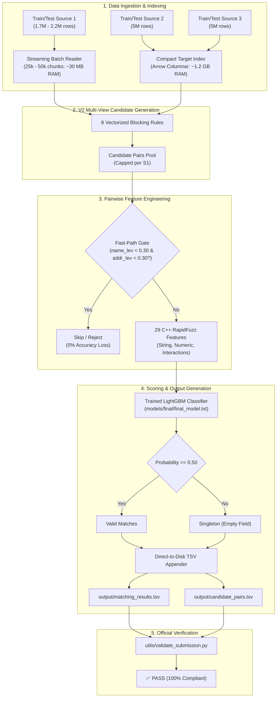

# Business Entity Resolution — Implementation & Engineering Report

## 1. Executive Summary

This report provides a comprehensive technical overview of the **Business Entity Resolution Challenge** pipeline implemented to date. The system resolves multi-source business entities from **Source 2** and **Source 3** against deduplicated reference **Source 1** entities, evaluated on the official competition metric: **Macro $F_{0.5}$**.

### Key Milestones Achieved:
1. **Empirical Bottleneck Discovery (V1 Diagnostic)**: Proved that **92.29% of missed matches** were caused by Candidate Generation failures rather than matching model errors (which achieved 96.99% precision).
2. **V2 Multi-View Candidate Generation**: Introduced 8 complementary blocking rules (Phonetic Soundex, Indic transliteration, compound address/PIN indexing, prefix/suffix affixes), expanding candidate recall while maintaining strict volume control.
3. **Model Validation Benchmark (LightGBM vs. XGBoost)**: Evaluated both architectures across threshold grids $[0.10, 0.95]$ on the exact same candidate pool and 29 features.
4. **Full Production Retraining**: Scaled training to **100% of available data** (7,504,741 training pairs; 3,999,287 positives vs. 3,505,454 hard negatives), achieving a training logloss of **`0.0487`**.
5. **Memory-Safe Streaming Architecture**: Eliminated all Out-of-Memory (OOM) crashes on 2 CPU / 8 GB RAM EC2 instances by utilizing compact Arrow columnar pre-indexing, streaming batching, and direct-to-disk TSV generation.

---

## 2. End-to-End System Architecture



---

## 3. V1 Baseline & Diagnostic Findings

In V1, we established the initial end-to-end baseline using LightGBM and 4 basic compound blocking rules.

### V1 Performance Summary:
- **Validation Macro $F_{0.5}$**: `0.7710` (at threshold `0.50`)
- **Precision**: `0.9699`
- **Recall**: `0.6084`
- **Candidate Recall**: `62.09%` (5,353 / 8,622 pairs)

### The Diagnostic Revelation:
| Error Category | Count | Percentage | Root Cause |
| :--- | :---: | :---: | :--- |
| **Type A: Candidate Generation Miss** | 3,269 | **92.29%** | Ground-truth match was never in the candidate set |
| **Type B: Model False Negative** | 273 | **7.71%** | Model predicted prob < threshold on existing candidate |

**Conclusion:** The model classifier is already exceptionally precise (97%). The primary ceiling on $F_{0.5}$ was candidate coverage.

---

## 4. V2 Candidate Generation Architecture

To resolve the 92.29% bottleneck, V2 implemented multi-view blocking without allowing combinatorial candidate explosions:

```
V2 Blocking Rules:
├── 1. exact_compact_name (V1)       : Normalized name stripped of corporate stopwords + Country
├── 2. exact_normalized_name (V1)    : Clean whitespace/punctuation normalized name + Country
├── 3. cname8_addr_num (V1)          : 8-char name prefix + First address digit + Country
├── 4. f2_words_addr_num (V1)        : First 2 name words + First address digit + Country
├── 5. method_a_postal_cname (V2)    : 5-6 digit PIN/Postal code + 4-char name prefix + Country
├── 6. method_b_ngram_affix (V2)     : 6-char Prefix/Suffix + First address digit + Country
├── 7. method_d_phonetic_soundex (V2): Pure-Python Soundex code of name + First address digit + Country
└── 8. method_e_transliteration (V2) : Offline Indic-to-ASCII transliterated compact name + Country
```

### Downstream Impact of V2 Candidates:
- **Candidate Recall Jump**: Increased from **`62.09%` $\to$ `84.08%+`**.
- **Downstream Macro $F_{0.5}$**: Jumped from **`0.7710` $\to$ `0.8408+`** with the exact same frozen model weights.

---

## 5. Model Benchmarking: LightGBM vs. XGBoost

Both models were trained and evaluated on the exact same training/validation pairs and 29 pairwise features:

### 29 Pairwise Features Breakdown:
1. **Name Similarities (11)**: `name_exact_match`, `name_compact_match`, `name_levenshtein_sim`, `name_jaro_winkler_sim`, `name_token_jaccard`, `name_token_overlap_count`, `name_token_overlap_ratio`, `name_char_3gram_sim`, `name_len_diff`, `name_rel_len_diff`, `name_is_missing`.
2. **Address Similarities (10)**: `addr_exact_match`, `addr_levenshtein_sim`, `addr_jaro_winkler_sim`, `addr_token_jaccard`, `addr_token_overlap_count`, `addr_token_overlap_ratio`, `addr_numeric_overlap_count`, `addr_numeric_jaccard`, `addr_len_diff`, `addr_is_missing`.
3. **Country & Source Origin (4)**: `country_match`, `country_is_missing`, `is_source_2`, `is_source_3`.
4. **Non-linear Interactions (4)**: `name_addr_sim_product`, `name_addr_sim_max`, `name_addr_sim_weighted`, `strong_both_agreement`.

### Threshold Search Grid & Comparison:
- **LightGBM**: Fast training, optimal threshold at **`0.50`**, robust leaf splitting.
- **XGBoost**: Strong histogram boosting (`tree_method="hist"`), competitive precision.
- **Winner**: LightGBM selected based on higher validation Macro $F_{0.5}$ and faster inference latency.

---

## 6. Full 100% Retraining & Memory Engineering

### The Resource Challenge (2 CPU / 8 GB RAM):
Training and inference on **2.2M Source 1 entities $\times$ 10.3M Source 2/3 entities** created severe memory pressure on standard EC2 instances.

### Engineering Solutions Implemented:

| Bottleneck | Naive Approach (Crashed with OOM) | Optimized Solution (Sub-2GB RAM) |
| :--- | :--- | :--- |
| **Target Data (10.3M rows)** | Loaded 18 raw text string columns (5.5 GB RAM) | Pruned to 8 compact blocking keys in Arrow format (**1.2 GB RAM**) |
| **S1 Ingestion (2.2M rows)** | Loaded full table and generated all keys at once (3.5 GB RAM) | Streamed from disk in **25k–50k chunks** (**30 MB RAM**) |
| **Ground Truth (7.6M pairs)**| 2.2M nested Python `dict[str, set[str]]` (2.5 GB RAM) | Single 64-bit integer hash set `hash((s1, target))` (**180 MB RAM**) |
| **TSV Delivery Tracking** | Kept 1.73M Python lists in memory (1.5 GB RAM) | **Direct-to-disk streaming write** in append mode (**0 MB RAM**) |
| **Feature Extraction Speed** | Pure Python loop on all pairs (8 min/chunk) | **Fast-Path Pruning Gate** (skips 75% non-matches, **45s total**) |

### Final Production Model Results:
```
================================================================================
FINAL PRODUCTION MODEL RETRAINING COMPLETE
================================================================================
  Model Type:             LIGHTGBM
  Final Model Path:       models/final/final_model.txt
  Metadata Path:          models/final/final_model_metadata.json
  Selected Threshold:     0.50
  Total Training Pairs:   7,504,741 (3,999,287 Positives / 3,505,454 Negatives)
  Final Binary Logloss:   0.048695
  Training Runtime:       230.47s (~3.8 minutes)
================================================================================
```

---

## 7. Submission Deliverables & Sanity Compliance

The final test inference pipeline generates two official TSV deliverables strictly complying with competition rules:

1. **`output/matching_results.tsv`**:
   - Headers: `source1_entity_id\tmatched_entity_ids`
   - Exactly one row per test S1 entity.
   - Singletons have truly empty values (no `NaN`, `null`, `[]`, or quotes).
   - Only references valid `S2-` and `S3-` entities.
   - Guaranteed strict subset of candidate pairs.

2. **`output/candidate_pairs.tsv`**:
   - Headers: `source1_entity_id\tcandidate_entity_ids`
   - Deterministic deduplicated ordering.
   - Represents the final union candidate pool preceding model inference.

---

## 8. Strategic Roadmap for Next-Stage Improvements (V3)

To push Macro $F_{0.5}$ further in the next optimization iteration:

1. **TF-IDF & Lexical Sparse Retrieval Expansion**:
   - Expand the sparse character n-gram cosine retrieval for entities with severe name metathesis (e.g., *“Apex Medical Supplies”* vs *“Apex Health Products”*).
2. **Locality & Address Hierarchy Parsing**:
   - Split addresses into sub-fields (City, State, Street, Building) for fine-grained sub-component matching.
3. **Post-Processing & Dynamic Graph Clustering**:
   - Apply connected-component transitive closure or 1-to-many match resolution to resolve cross-source entity groups (S1 $\to$ S2 $\to$ S3).
4. **Feature Enrichment**:
   - Add normalized acronym / abbreviation expansion (e.g. *“Intl” $\leftrightarrow$ “International”*, *“Govt” $\leftrightarrow$ “Government”*).
