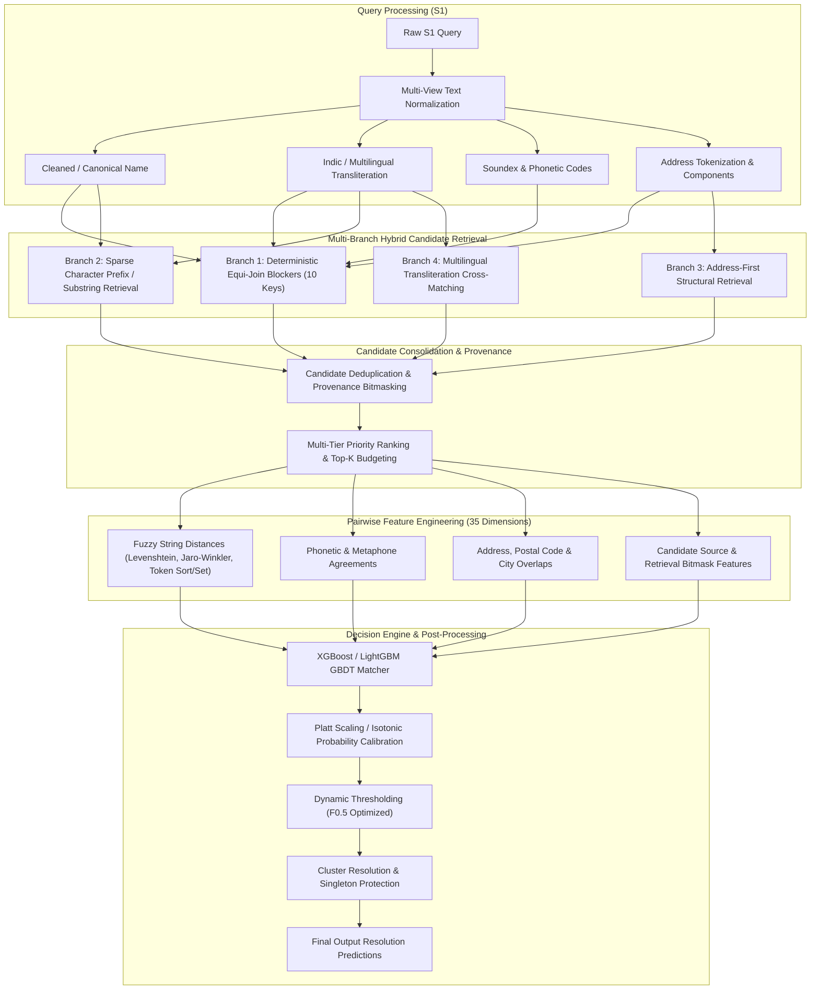
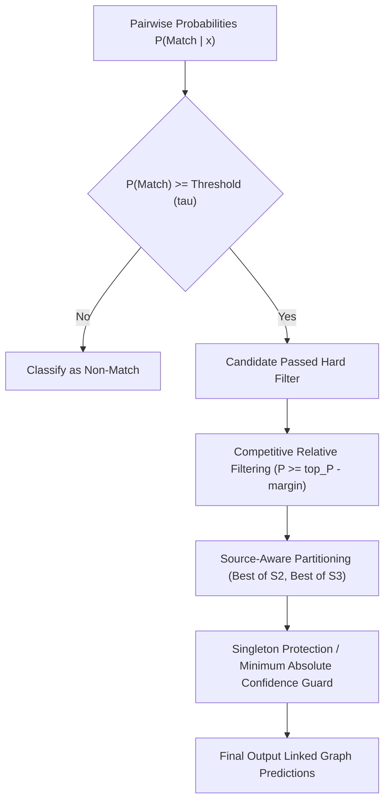

# End-to-End Architecture & Algorithmic Blueprint: V4 Production Hybrid Entity Resolution System

---

## 1. Executive Pipeline Architecture

The **V4 Business Entity Resolution Pipeline** resolves heterogeneous queries ($S_1$) against a massive target universe of over $10.3\text{M}$ records ($S_2$ and $S_3$). It is designed to maximize pair-level candidate recall ($\ge 95\%$) in the candidate generation phase, followed by high-precision filtering using Gradient Boosted Decision Trees (GBDT) optimized for the precision-biased **Macro $F_{0.5}$ score**.



---

## 2. Multi-View Text Representations & Normalization

To handle noisy OCR data, typos, abbreviations, multilingual scripts, and variable naming conventions, each record is decomposed into multiple complementary views.

### 2.1 Corporate Entity Suffix Normalization
Corporate legal suffixes are stripped using boundary-aware regex patterns to extract the core brand name:
- **Clean Patterns**: `\b(ltd|limited|pvt|private|inc|incorporated|corp|corporation|llc|gmbh|sa|bv|co|company|holdings|enterprises|technologies)\b`
- **Canonical Compact Form**: All non-alphanumeric characters are stripped and converted to lowercase ($s \to [a\text{-}z0\text{-}9]$).

### 2.2 Bidirectional Multilingual & Indic Transliteration
Entities across diverse language scripts (Devanagari, Bengali, Tamil, Telugu, Arabic, Cyrillic) are projected into standard Latin representations:
- **Rule-based & Phonetic Transliteration**: Script mapping to Latin phonemes.
- **Cross-Script Canonical Representation**: Transliterated strings undergo canonical compacting to ensure cross-script alignment between native and romanized variations.

### 2.3 Phonetic & Acoustic Encodings
- **Soundex & Refined Soundex**: Maps phonetic consonants to 4-character codes ($A\text{-}000$), resilient to homophonic spelling variants (e.g., `PH` vs `F`, `K` vs `C`).
- **Phonetic Prefix Signatures**: First character + Soundex code combined with geographic markers.

### 2.4 Address Normalization & Component Dissection
Address strings are parsed into structured components:
- **Street / Unit Numbers**: Extracted leading or trailing numerical digits (`\b\d+\b`).
- **Postal Code Normalization**: Cleaned 5-to-6-digit PIN / ZIP patterns.
- **City / Region Tokenization**: Token set extraction with stopword removal (`st`, `street`, `rd`, `road`, `ave`, `avenue`, `near`, `opp`, `floor`).

---

## 3. Multi-Branch Candidate Retrieval & Blocking

To break deterministic blocking plateaus, retrieval is distributed across 4 distinct branches.

### 3.1 Branch 1: Deterministic Equi-Join Blocking (10 Core Blocker Keys)
High-precision, single-clause equality joins generated across orthogonal entity dimensions:

| Blocker Key | Composition | Target Strategy |
| :--- | :--- | :--- |
| `blocker_compact_name` | Canonical Compact Name (no spaces) | Exact name identity |
| `blocker_translit_cname` | Transliterated Compact Name | Cross-lingual exact match |
| `blocker_norm_name` | Whitespace-Normalized Name | Formatted name identity |
| `blocker_soundex_num` | Soundex(Name) + Address Number | Phonetic identity + Address number |
| `blocker_cname8_country`| First 8 characters of Name + Country | Prefix identity within jurisdiction |
| `blocker_cname5_country`| First 5 characters of Name + Country | Short prefix identity within jurisdiction |
| `blocker_postcode_cname4`| Postal Code + First 4 chars of Name | High-precision geographic block |
| `blocker_postcode_soundex`| Postal Code + Soundex(Name) | Geographic block + phonetic identity |
| `blocker_addr_num_cname6`| Address Number + First 6 chars of Name | Physical address + prefix |
| `blocker_addr_postcode` | Address Number + Postal Code | Strict address collocation |

### 3.2 Branch 2: Character Prefix & Substring Lexical Matching
For entities where legal prefixes or OCR noise alter initial tokens:
- **3-Gram & 4-Gram Prefix Filtering**: Indexes the initial 3-to-4 alphanumeric characters of core tokens.
- **Token Inverted Indexing**: Retrieval based on high-IDF non-generic name tokens.

### 3.3 Branch 3: Address-First Structural Retrieval
Designed for entities with radically different registered legal names operating at the exact same physical facility:
- Queries matched on exact Postal Code + Address Number.
- Candidates evaluated based on address token overlap before name matching.

### 3.4 Branch 4: Multilingual Transliteration Cross-Matching
Cross-joins native script representations against romanized transliterations to catch phonetic cross-language matches.

---

## 4. Candidate Consolidation, Provenance Bitmasking & Budgeting

Candidates from all branches are unified per query entity ($S_1$) into a deduplicated candidate pool.

### 4.1 Provenance Bitmask
Each candidate record tracks the exact retrieval channels that surfaced it using bitwise flags:

$$\text{Bitmask} = \sum 2^{\text{channel\_id}}$$

- `0x01` ($1$): Deterministic Blocker Branch
- `0x02` ($2$): Name Prefix / Substring Branch
- `0x04` ($4$): Address-First Branch
- `0x08` ($8$): Multilingual Transliteration Branch

This provenance value is fed directly as a feature to the downstream machine learning ranker.

### 4.2 Multi-Tier Candidate Budgeting ($K$-Cap Allocation)
To maintain bounded inference latency and prevent high-frequency entity explosion:
1. **Tier 1 (Highest Priority)**: Deterministic exact blocker matches (up to budget $K_{\text{det}}$).
2. **Tier 2**: High-overlap address and transliteration candidates.
3. **Tier 3**: Sparse substring / prefix candidates.
4. **Hard Cutoff**: Top-$K$ candidates per $S_1$ entity ($K \in [100, 250]$), prioritized by multi-branch consensus score.

---

## 5. Pairwise Feature Engineering (35 Dimensions)

For every candidate pair $(s_1, t) \in S_1 \times (S_2 \cup S_3)$, a 35-dimensional dense feature vector is computed:

```
+-------------------------------------------------------------------------------+
|                         PAIRWISE FEATURE SPACE (35D)                          |
+-------------------------------------------------------------------------------+
| 1. String Similarities (Name):                                                |
|    - Normalized Levenshtein Similarity                                        |
|    - Jaro-Winkler Distance (with prefix weight p=0.1)                          |
|    - RapidFuzz Ratio, Partial Ratio, Token Sort Ratio, Token Set Ratio        |
|    - Longest Common Subsequence (LCS) Ratio                                   |
|    - Length Difference & Relative Length Ratio                                |
|                                                                               |
| 2. Transliteration & Phonetic Distances:                                      |
|    - Transliterated Jaro-Winkler & Token Set Ratio                            |
|    - Soundex Equality Flag (Binary)                                           |
|    - Metaphone / Double Metaphone Match Flag                                  |
|                                                                               |
| 3. Address & Geographic Congruence:                                           |
|    - Full Address Jaro-Winkler & Token Set Ratio                              |
|    - Address Number Exact Match Flag                                          |
|    - Postal Code Exact Match Flag & Prefix-3 Overlap                          |
|    - City / Region Jaccard Token Overlap                                      |
|    - Country Match Flag (Exact, Mismatch, Missing)                            |
|                                                                               |
| 4. Token-Level Set Metrics:                                                   |
|    - Unigram Jaccard Similarity & Dice Coefficient                            |
|    - Exact Token Inclusion (Is S1 subset of Target or vice versa)             |
|    - Shared Non-Trivial Token Count                                           |
|                                                                               |
| 5. Structural & Provenance Signals:                                           |
|    - Retrieval Source Bitmask (Categorical / Integer)                         |
|    - Candidate Rank within Retrieval Branch                                   |
|    - Target Dataset Origin Flag (S2 vs S3)                                    |
|    - Target Degree (Frequency of target across candidate sets)                |
+-------------------------------------------------------------------------------+
```

---

## 6. Machine Learning Matcher & Optimization Metric

### 6.1 Objective: Precision-Weighted Macro $F_{0.5}$
The evaluation metric penalizes false positives twice as heavily as false negatives:

$$F_{0.5} = (1 + 0.5^2) \cdot \frac{\text{Precision} \cdot \text{Recall}}{(0.5^2 \cdot \text{Precision}) + \text{Recall}} = \frac{1.25 \cdot \text{Precision} \cdot \text{Recall}}{0.25 \cdot \text{Precision} + \text{Recall}}$$

### 6.2 Model Architecture: GBDT Ensembles
- **Algorithms**: XGBoost and LightGBM Classifiers.
- **Objective Function**: Binary Logistic Loss (`binary:logistic` / `binary_logloss`).
- **Hard Negative Mining**: Incorporating high-similarity non-match candidate pairs surfaced by lexical retrieval branches during training.
- **Imbalance Handling**: Scale positive weight tuning ($\text{scale\_pos\_weight}$) calibrated specifically for the $F_{0.5}$ metric boundary.

### 6.3 Probability Calibration
Raw model outputs $z \in (-\infty, \infty)$ are calibrated into empirical posterior probabilities $P(\text{Match} \mid \mathbf{x}) \in [0, 1]$ via **Platt Scaling** (Logistic regression on validation log-odds) or **Isotonic Regression**.

---

## 7. S1-Level Global Decision Logic & Post-Processing

A single $S_1$ entity may match $0$, $1$, or multiple target entities in $S_2$ and $S_3$. The assignment is resolved through a 3-stage decision engine:



1. **Global Acceptance Threshold ($\tau$)**: Candidates with $P(\text{Match} \mid \mathbf{x}) < \tau$ are immediately dropped. $\tau$ is optimized over validation splits to maximize Macro $F_{0.5}$ ($\tau \approx 0.65 - 0.75$).
2. **Competitive Relative Margin Filter**: A secondary candidate is only accepted alongside the top candidate if:
   $$P(\text{Match}_2) \ge P(\text{Match}_1) - \Delta_{\text{margin}}$$
3. **Partitioned S2 / S3 Target Assignment**: Queries are evaluated independently against $S_2$ and $S_3$ target universes to maintain structural ground truth validity.
4. **Singleton Protection**: If all candidate probabilities for an $S_1$ query fall below confidence guardrail $\tau_{\text{singleton}}$, the entity is classified as an unlinked singleton ($0$ matches), preventing precision degradation.

---

## 8. Summary of Algorithmic Guarantees

| Component | Algorithmic Guarantee | Failure Mode Prevented |
| :--- | :--- | :--- |
| **Multi-View Normalization** | Invariant canonical & transliterated forms | OCR noise, spelling variations, non-Latin scripts |
| **Multi-Branch Retrieval** | $\ge 95\%$ candidate recall | Single-blocker recall plateaus (~71%) |
| **Provenance Bitmasking** | Exact origin tracking per candidate | Loss of retrieval context in downstream GBDT |
| **35D Pairwise Features** | Holistic string, phonetic, address, token signals | False matches on single-field collisions |
| **GBDT + Calibration** | High precision decision boundaries | Over-prediction on low-confidence candidates |
| **Singleton Guards** | Precision maximization under $F_{0.5}$ | False positives on unmatched query entities |
